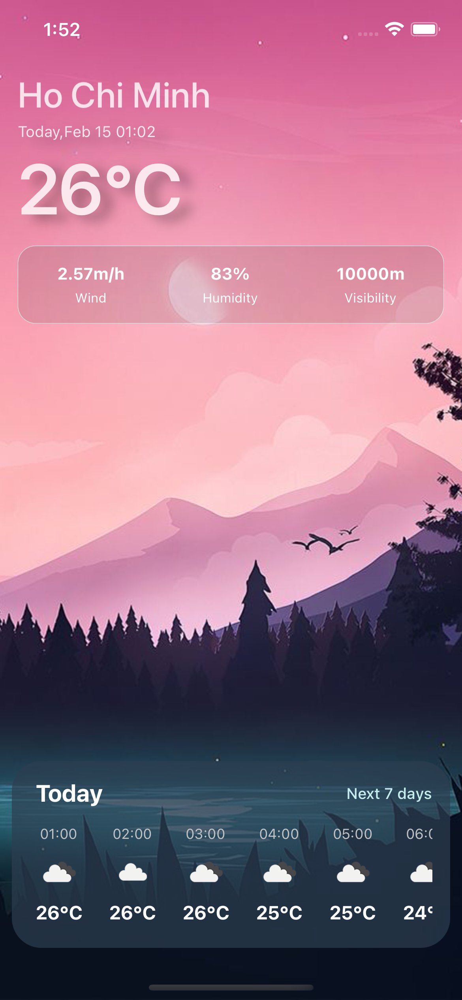
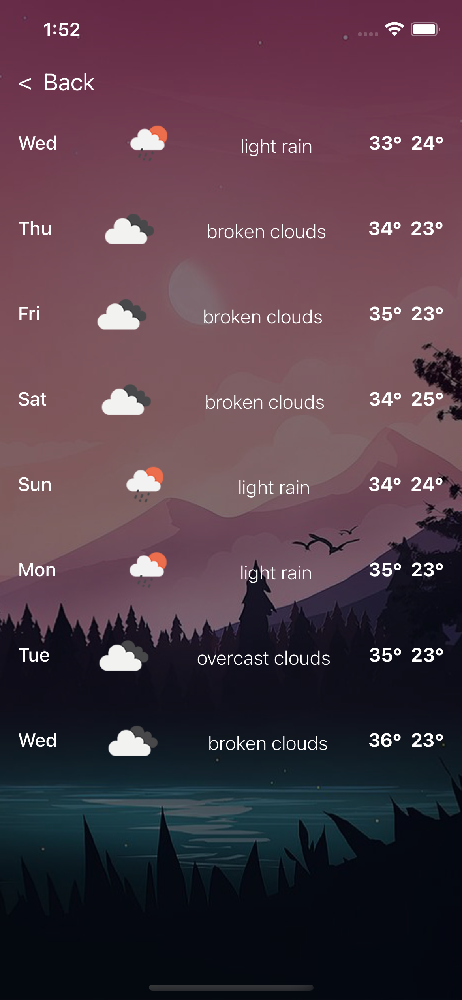

## Project Title

FirekampExercise

## How to Run

Check src/constants/index.ts file and add your key to OPEN_WEATHER_MAP_API_KEY

```js
const OPEN_WEATHER_MAP_API_KEY = 'PUT_YOUR_KEY_HERE';
```

Then going to install dependencies

```bash
yarn install
```

### Run iOS

```bash
yarn ios
```

### Run Android

```bash
yarn android
```

## Libraries used

> ▶️ React Navigation: For navigation purpose, because I'm build 2 screen Home and DailyForecast so need to handle navigate go and back between these 2 screens

> 🕥 dayJs: Due to need display date information, so dayJs is a minimalist JavaScript library for handle datetime, and also it's about 2kB JavaScript date utility library instead of using Moment

> 📚 lodash: Some utility functions

> ⚠️ react-native-error-boundary: Because this will help catch Javascript errors anywhere in their child component tree, log those errors, and display fallback UI https://reactjs.org/docs/error-boundaries.html

> 🗽 Recoil: A small, fast, and flexible shared state, because we need to using data from OpenWeatherMapApi, but need to display at multiple places, that's why I'm using recoil (of course we still can try passing props using react-navigation, but this might be easier and good for scale)

> 💅🏾 styled-components: This will help style your apps without stress, instead of increase the complexity of folder and files by create more styles.css, using this can make code clean and short

## A screenshot/gif of what was made

Include a screenshot or gif of your project here.




## What you would do if you had more time

If you had more time to work on this project, Here are additional features or improvements you would add.

- [ ] Provide city suggestion when typing
- [ ] Check device current location position and set as default initial value instead of hard code position
- [ ] Randomize background image
- [ ] Detect weather and show background image match with weather description
- [ ] Able to select hourly to fetch more additional info (Wind, humidity, visibility ...etc...)
- [ ] Display more aditional info when in UI next 7 days
- [ ] Add some city as favorite city and showed it's on home screen
- [ ] Add animation
- [ ] Configure environment variables using react-native-config instead of hard code
- [ ] Improve UI/UX for error case
- [ ] Retry method when facing error problem
- [ ] Add react-native-vector-icons and add more icons in (Wind, humidity, visibility ...etc...)
- [ ] Add splash screen and app icon
- [ ] Add unit test & integration test
- [ ] Clean up structures
